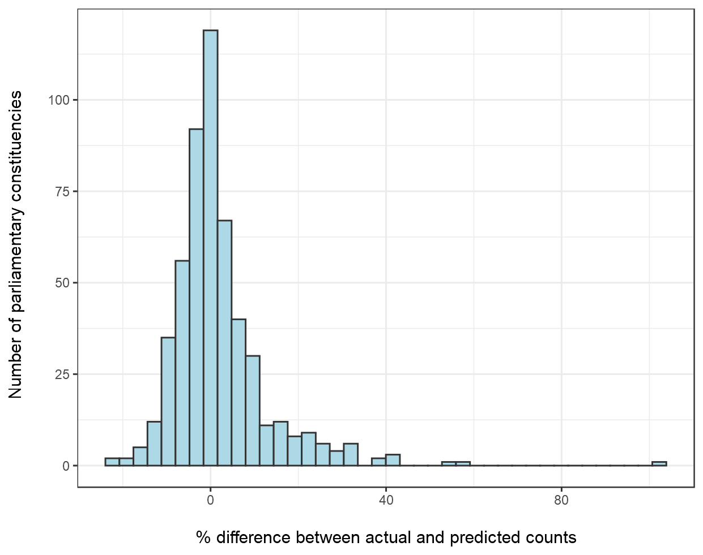

```{r setup, include=FALSE}
knitr::opts_chunk$set(echo = F, warning = F, message = F)
```

## Introduction

This paper provides full methodological detail on the approach used to create estimates of the various indicators of childhood vulnerability included in the Children's Commissioner's Office's [CHLDRN](https://www.childrenscommissioner.gov.uk/chldrn) web application. This approach has been applied to indicators where it is not possible to directly calculate the numbers of relevant children either from available microdata such as the National Pupil Database or by combining published aggregate statistics.

We first present an overview of the methodology for creating these estimates and then demonstrate an example of this method applied to children in households claiming universal credit. Finally, as validation of the methodology we present a comparison of our predicted numbers of households with children claiming universal credit at parliamentary constituency level against published figures available from the Department for Work and Pensions [StatXplore](https://stat-xplore.dwp.gov.uk/webapi/jsf/login.xhtml).

## Overview of reprojection methodology

### Basic premise

This methodology borrows heavily from the technique of Dasymmetric Mapping, commonly used in GIS applications (see for example [Ennis 2003](https://www.tandfonline.com/doi/abs/10.1111/0033-0124.10042?journalCode=rtpg20)). Its aim is to allow us to reproject data from one aggregate area (our input geography) to another aggregate are (our output geography) where this is not directly possible from published statistics or available microdata.

The key idea behind our approach is to partition counts of a particular indicator of interest only available at a large aggregate area input geography (such as a county council) down to lower super output areas (LSOAs) and then reaggregate these smaller unit estimates up to the desired output geography such as Clinical Commissioning Group or Parliamentary Constituency. The proportion of our indicator of interest assigned to each LSOA is weighted based on population and rates of factors that are correlated with our indicator of interest and are available at both our higher level geography and at LSOA level.

### Creating LSOA mappings to output geographies

As stated above the effective building blocks of our output geography estimates are lower super output areas. These are geographic units derived for the 2011 Census aiming to have reasonably similar numbers of households per LSOA. They are also deliberately co-terminus with a wide variety of other administrative geographies. Where these are not directly co-terminus (as with parliamentary constituencies), for the small number of LSOAs that fall into more than one constituency, we have assigned each LSOA to the output geography that it most overlaps. For context only 7% of LSOAs fall into more than one parliamentary constituency in England and amongst those that do only 100 (0.03%) overlap another constituency (other than its majority one) by more than 5% of its area.

### Detailed estimation methodology

To reproject a given indicator of levels of childhood vulnerability (hereafter our 'outcome indicator') that is published at a given input geography to a different output geography, we utilise the following method:

1. Can the published aggregate input geography be aggregated up to directly estimate a desired output geography? If so we use this aggregation as our output geography estimate. For example indicators that are published at local authority district level can be directly aggregated to produce indicators at Upper Tier Local Authority level as these geographies are co-terminus.

2. If not, aggregate all predictor measures listed in Appendix A (hereafter 'predictors') up to our input geography level and calculate rates by the relevant population denominator. we then estimate which (if any) of these predictor rates are significant correlates of our indicator of interest at this input geography level via univariate correlation tests. Given the large number of tests and the related risk of correlations only being due to random chance, we apply a Bonferroni correction to our correlations and retain only the predictors with a p value of less than 1/number of tests performed.

3. To reduce the number of variables down to a manageable level and avoid having too many variables in our predictive model, we perform principal components on the set of predictors retained in step 2. We then correlate each of the estimated components with our 'outcome indicator' and retain only components with a significant correlation to our outcome of interest (again with p values corrected for the number of components tested).

4. We then estimate a Poisson regression model with a population offset term to estimate the multivariate relationship between our retained components and rates of our outcome indicator at our input geography (hereafter our 'prediction model'). We estimate the D-squared statistic ([Guissan & Zimmerman 2000](https://www.sciencedirect.com/science/article/abs/pii/S0304380000003549)) for this model demonstrating the proportion of deviance from the null model that is accounted for by our prediction model. This D-squared statistic forms the basis for our RAG rating used with the CHLDRN app, with estimate reliability accounted for by the proportion of deviance explained by our prediction model. The specific thresholds for each RAG rating are set out in Table 1 below.

```{r}
require(data.table)
require(kableExtra)

knitr::kable(data.table(`RAG rating`=c("Poor","Low","Medium","High"),
                         `D-squared statistic threshold`=c("No predictors found to be correlated - estimates are simple pro-rata",
                                      "Less than 0.33",
                                      "0.33-0.66",
                                      "0.66+")),"html"
) %>% kable_styling()
```

5. We then calculate the same rates as in step 2 at LSOA level. We smooth these rates via the same shrinkage method as used in the indices for multiple deprivation (see [Mclennan et al 2019](https://assets.publishing.service.gov.uk/government/uploads/system/uploads/attachment_data/file/833951/IoD2019_Technical_Report.pdf) for details). This smoothing is to avoid apportioning too much of a large local authority's value to smaller population LSOAs who's rates are likely to fluctuate simply due to their smaller numbers of children/people in these areas. We apply this smoothing to all predictors except those sourced from the indices of multiple deprivation which have already been smoothed in this manner.

6. From these smoothed rates, we then calculate component scores for each LSOA using the loadings calculated in step 3. We then apply our estimated prediction model from step 4 to these component scores to calculate a predicted rate on our outcome indicator for each LSOA. From this predicted rate we then calculate a predicted number of children through multiplying by the relevant population denominator (hereafter our 'predicted LSOA populations').

7. Within each unit of our input geography, we sum the corresponding predicted LSOA populations to calculate a total predicted population for each unit of input geography. We then divide each LSOA's predicted  population by the corresponding total population to estimate the proportion of the input geography unit's outcome indicator total that is accounted for by each LSOA within an input geography unit.

8. We then apply these proportions to the published input geography totals to calculate an estimated number on our outcome indicator for each LSOA. We then sum these estimated LSOA totals to their corresponding output geography units to produce our final estimates.

## Validation: Households with children claiming universal credit

Data on households with children claiming universal credit are available both at local authority district level and for parliamentary constituencies via the Department for Work and Pensions (DWP) [StatXplore tool](https://stat-xplore.dwp.gov.uk/). As initial validation of this methodology we apply the steps above to the LA district level published figures for this outcome indicator and reproject these to parliamentary constituency level. We compare the results to published totals below.

Overall there is a high level of agreement between estimated counts and those published by DWP, suggesting that overall these provide good approximations on this indicator. The mean difference between estimated counts and actual counts is +1.8% with a median of <0.05%. 80% of constituencies are within 10% of their published totals. However, there is some variation in accuracy, for example there are 37 out of the 533 constituencies that are more than 20% above their published totals (Figure 1). This suggests, while these estimates provide a useful starting point, this approach is not a direct replacement for collecting more granular data and/or published data at varying geographic levels.

**Figure 1: Percentage difference between estimated and actual counts of households witch children claiming universal credit by parliamentary constituency**

```{r, out.height=6, out.width=6}



```


## Appendix A: LSOA level variables used as predictors

```{r}

tb<-data.table::fread("C:/Users/TCLARKE1/OneDrive - Department for Education/Documents/Ad hoc/Covid/web_app/update data/predVars_projections.csv")

knitr::kable(tb,"html"
) %>% kable_styling()

```

